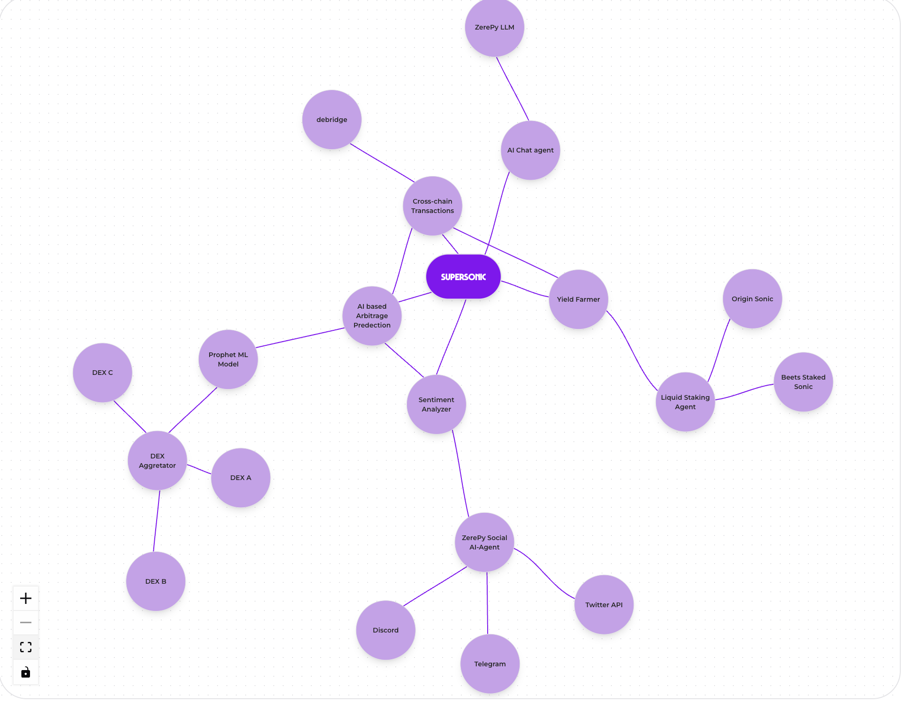
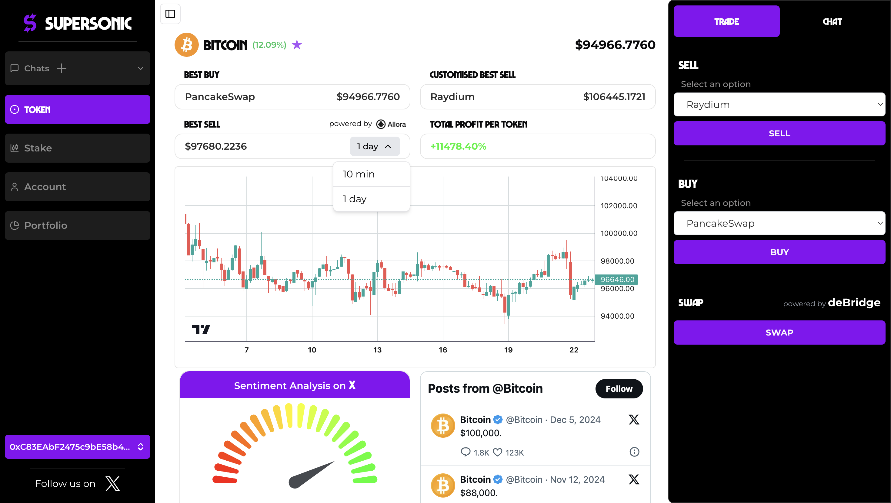
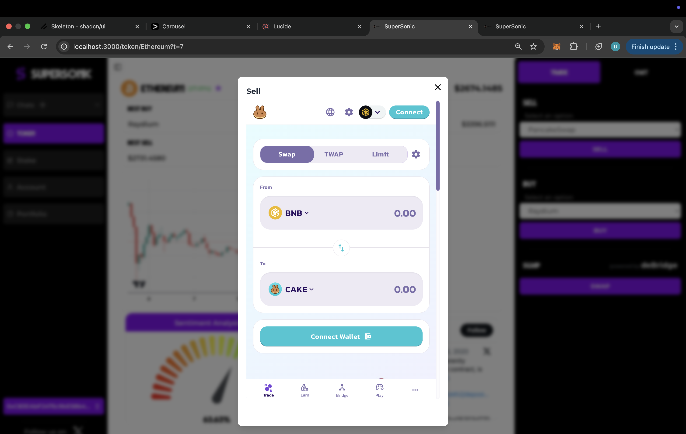
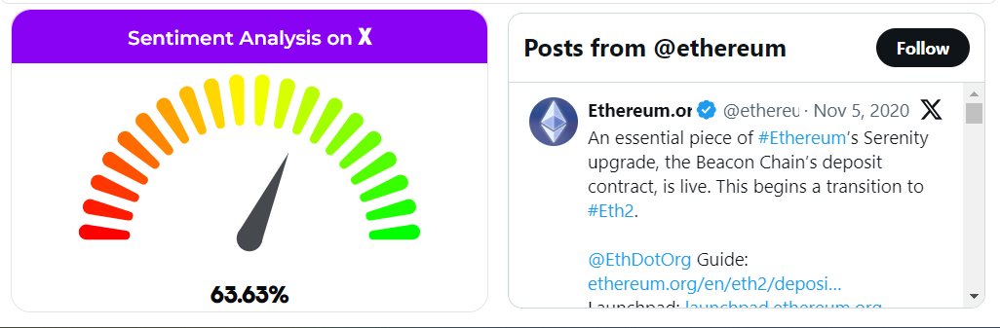
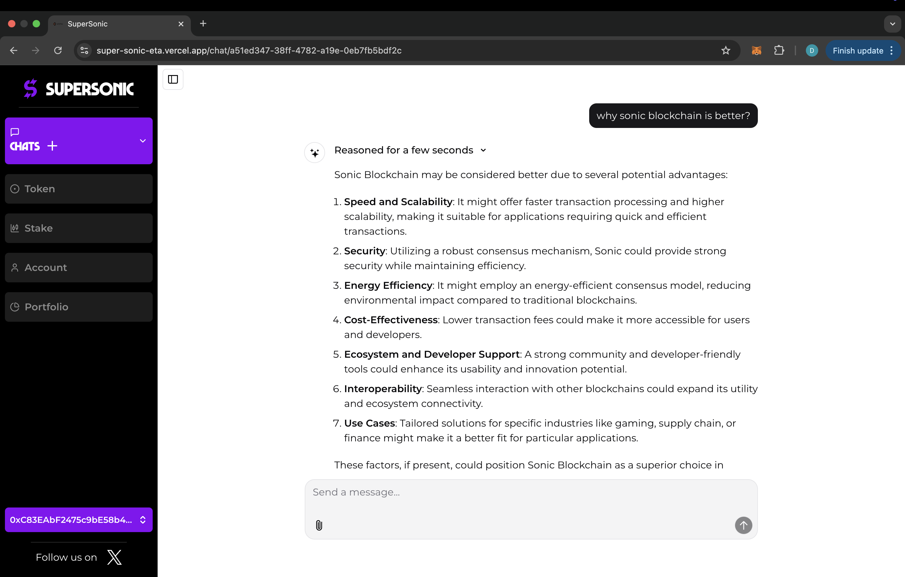
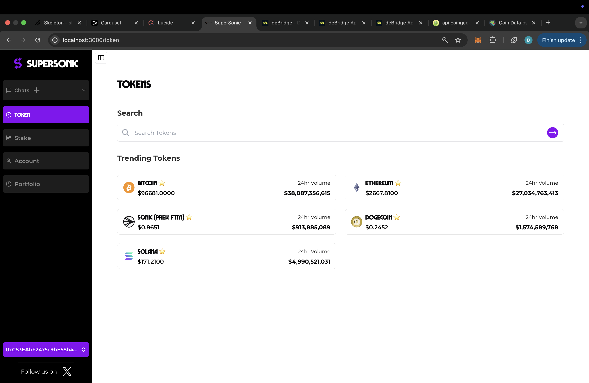
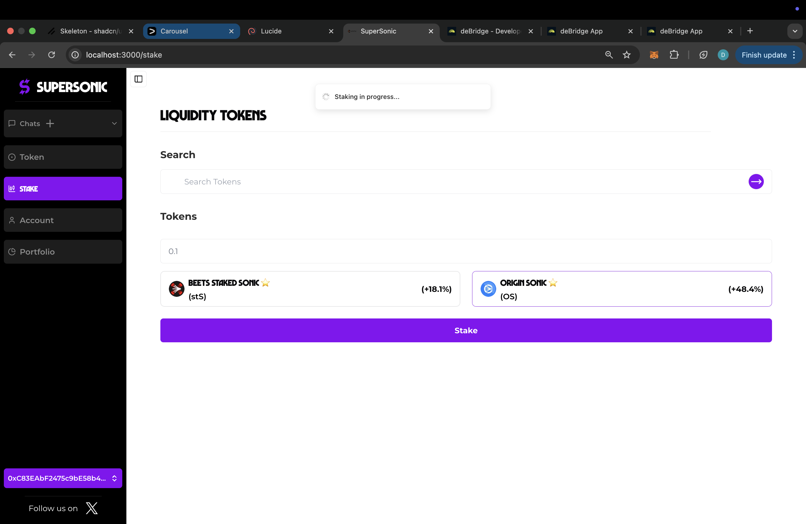
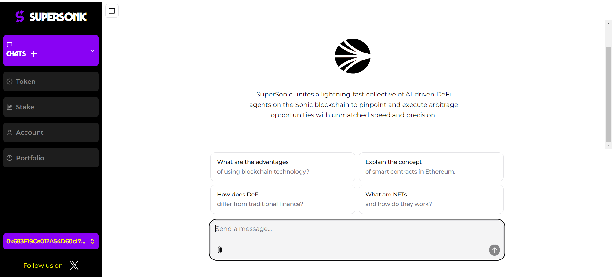

# SuperOra

## Table of Contents

- [Introduction](#introduction)
- [Motivation](#motivation)
- [Tech Stack](#tech-stack)
- [Core Features](#core-features)
- [Concepts](#concepts)

# Introduction

SuperOra is an AI-powered arbitrage and analytics platform designed to optimize trading strategies in the Web3 ecosystem. It features an **AI chat agent** for real-time market insights, personalized trending tokens suggestions based on social media interactions, and **Twitter sentiment analysis** to enhance predictive accuracy. By analyzing past **DEX performance data**, liquidity trends, and trading volumes, Sonic refines arbitrage strategies and forecasts high-potential tokens by combining historical data with sentiment analysis. Additionally, it supports **liquid staking** which enables users to maintain liquidity while contributing to network security and to maximize capital efficiency..  

# Architecture

SuperOra is an AI-powered, cross-chain arbitrage platform on the Sonic blockchain, designed for real-time predictive trading and liquidity optimization. It integrates a data aggregation layer to fetch market data from DEXs, blockchain oracles, and social sentiment analysis powered by ZerePy AI models. The AI-driven arbitrage engine identifies pricing inefficiencies using predictive analytics and anomaly detection, ensuring profitable trade execution. Through deBridge integration, it enables instant cross-chain arbitrage. Additionally, users can stake liquidity tokens to earn rewards, contributing to enhanced platform liquidity. Built for high-speed, automated DeFi trading, it redefines arbitrage on Sonic with AI, staking, and cross-chain efficiency.  

# Motivation

The crypto ecosystem often exhibits short-lived price discrepancies across different DEXs and blockchains. Exploiting these arbitrage opportunities manually is challenging, especially considering the rapid market pace and cross-chain complexity. It aims to automate this process using:

- **Predictive AI** to forecast potential price gaps,
- **Sonic’s high throughput** to ensure fast execution,
- **deBridge integration** for cross-chain liquidity movement,
- **Trust-minimized smart contracts** to secure user funds.

- **ZerePy integration** for efficient backtesting and strategy optimization

- **Allora Network integration** for short-term price prediction of major cryptocurrencies

 - **Liquidity Staking** to fetch the best liquid staking yields for tokens

By streamlining the entire arbitrage lifecycle—data collection, analysis, and execution—SuperOra helps traders capture fleeting opportunities efficiently.

# Tech Stack

**AI and Machine learning models:**
- **Python & ZerePy:**  
  - Automate data collection, tweet fetching, posting, and even token transfers on Sonic.
  - Integrate ZerePy’s functions to streamline AI tasks.
- **Flask:**  
  - Serve as the backend server to orchestrate AI models, data pipelines, and API endpoints.
- **Prophet Model:**  
  - Used for forecasting future prices based on historical data.
- **Llama (LLM):**  
  - Fetch and analyze trending coins, leveraging its natural language capabilities.
- **Sentiment Analysis:**  
  - Analyze tweets related to specific coins and DEX performance to inform the AI predictions.

**Blockchain & Smart Contracts:**
- **Sonic Blockchain:**  
  - EVM-compatible, high-performance network for executing trades.
- **deBridge:**  
  - Enables seamless cross-chain asset transfers.
- **Solidity, Hardhat/Foundry:**  
  - For developing, testing, and deploying smart contracts.

**Frontend:**
- **Next.js:**  
  - Framework for building a responsive, server-side rendered UI.
- **Drizzle & Ethers:**  
  - For interacting with smart contracts on the blockchain.
- **NextAuth & SWR:**  
  - Authentication and data fetching libraries for a smooth user experience.
- **Tailwind CSS & Radix-UI:**  
  - For fast, customizable, and accessible UI components.
- **ai-sdk:**  
  - For integrating additional AI-driven features directly into the frontend.

# Core Features

Below is a breakdown of SuperOra’s features, designed to optimize the entire arbitrage flow:

### 1. **AI-Driven Prediction**
Analyze on-chain data (DEX volumes, order books, liquidity) and off-chain sentiment (social media, news) to forecast imminent price discrepancies. ZerePy’s machine learning models continually refine these predictions.

### 2. **Multi-DEX & Multi-Chain Integration**
Aggregate price data from multiple DEXs (e.g., Uniswap, SushiSwap) and across different blockchains. deBridge ensures smooth token transfers between Sonic and other chains for broader arbitrage opportunities.

### 3. **Twitter Sentiment Analysis**

The Twitter Sentiment Analysis feature uses ZerePy to scrape and analyze tweets on specific coins and DEX performance, deriving sentiment scores to enhance the predictive model with real-time market trends, improving arbitrage accuracy.

### 4. **AI-Powered Chat Agent**  

The AI-powered chat agent enables users to get quick responses and real-time information on any coin and the broader Web3 ecosystem. Utilizing advanced NLP models, it understands queries and fetches relevant data from blockchain analytics, exchange data, and sentiment analysis tools. By providing instant insights and trend analysis, it enhances user decision-making, making it a powerful tool for Web3 traders and investors.

### 5. **Personalized Trending Tokens**  

This feature suggests trending tokens based on the social media activity of people you follow. By analyzing influencers' interactions, it curates personalized token trends, helping users stay ahead in the Web3 ecosystem.

### 6. **Liquid Staking**

Sonic introduces liquid staking with **Beets Staked Sonic (stS)** and **Origin Sonic (OS)**, allowing users to stake assets while retaining liquidity. This enhances capital efficiency by enabling participation in DeFi strategies while earning staking rewards. By integrating liquid staking, Sonic strengthens its ecosystem, driving higher user engagement, increasing protocol TVL, and fostering a more dynamic staking economy.

### 7. **Allora Network Integration**
 Supports short-term price prediction of major cryptocurrencies like BTC, Ethereum, and other coins to enhance arbitrage strategies.

### 7. **User-Friendly Dashboard**
- **Real-Time Analytics:** View predicted arbitrage windows, potential profit, and execution status.
- **Wallet Integration:** Connect popular wallets (e.g., MetaMask, WalletConnect) for secure interactions.
- **Trade Logs:** Track historical performance and refine strategy using detailed trade histories.

# Concepts

1. **Predictive Modeling with ZerePy**  
   ZerePy’s models ingest DEX order book data, liquidity metrics, and social sentiment signals to generate probability scores for potential arbitrage. These scores inform the platform’s automated execution.

2. **Cross-Chain Transfers via deBridge**  
   deBridge acts as the cross-chain gateway, allowing SuperOra to seamlessly move assets between Sonic and other networks (like Ethereum, BNB Chain). This expands the scope of arbitrage beyond a single chain.

3. **Liquidity Staking Tokens on Sonic**  
   Liquidity staking tokens on Sonic, including stS and OS, ensure efficient staking and yield optimization while maintaining flexibility and security.